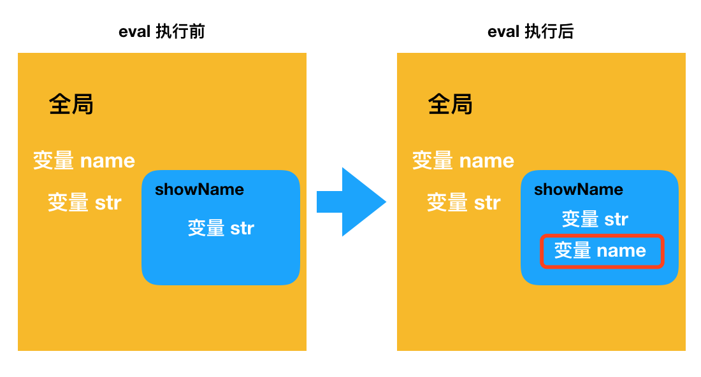
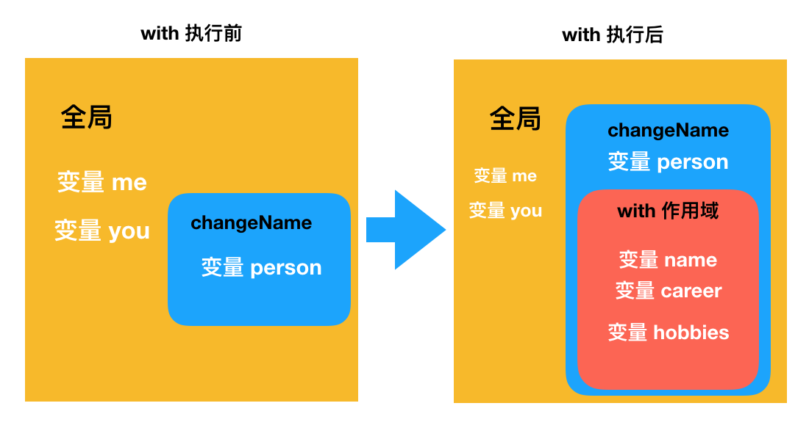
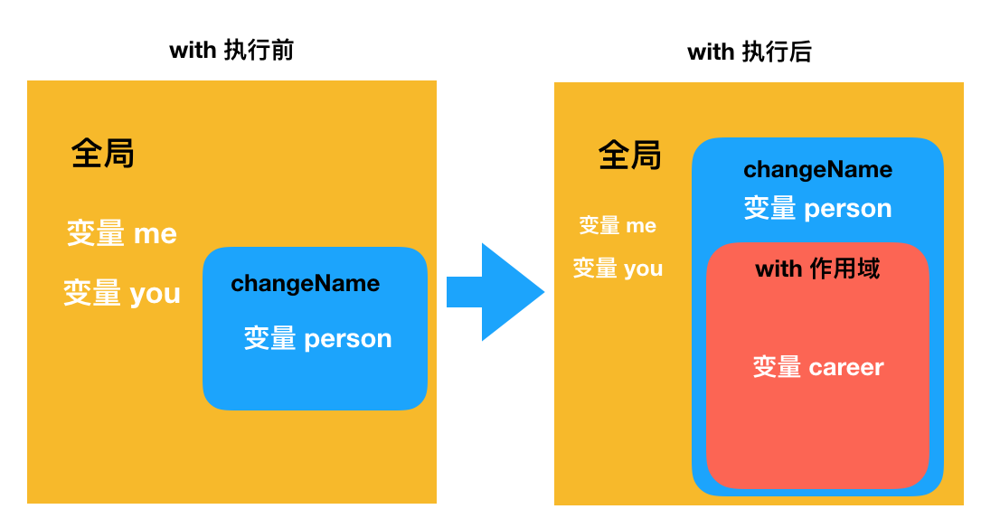
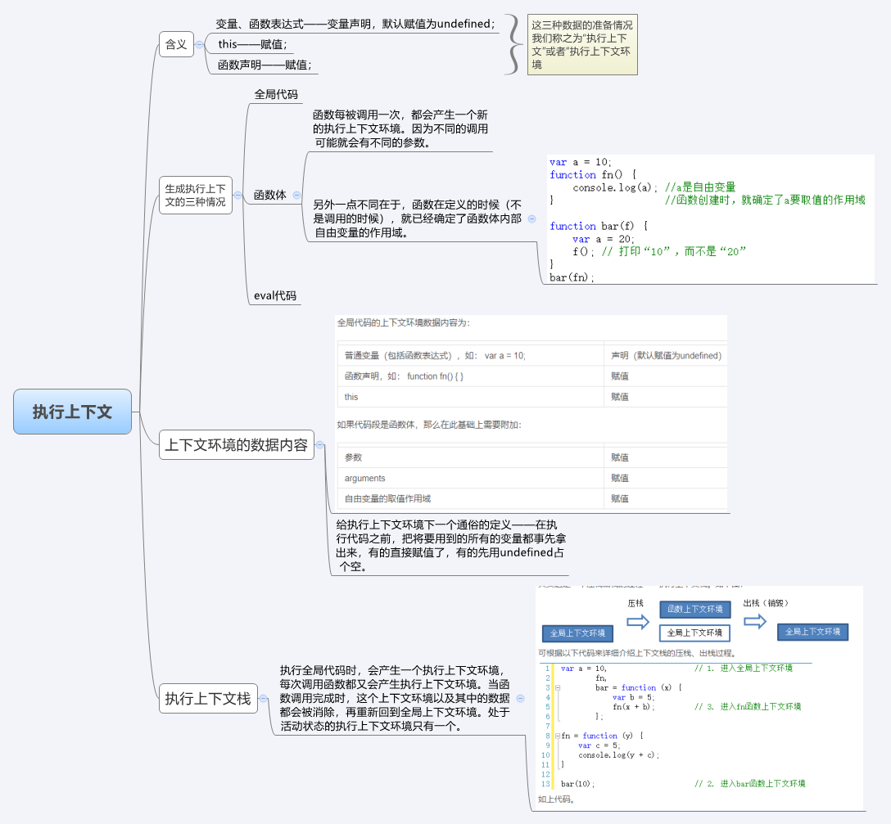
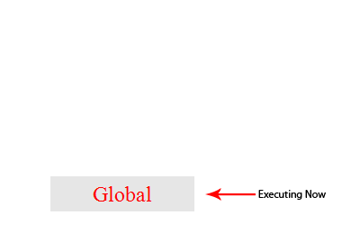
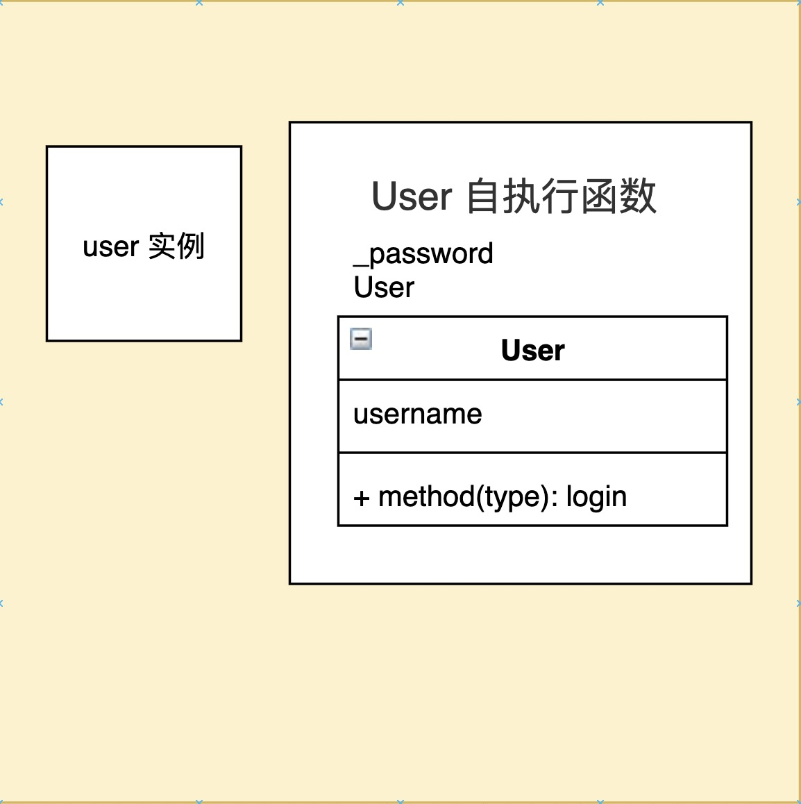

## LHS 和 RHS 

LHS、RHS，是引擎在执行代码的时候，查询变量的两种方式。其中的 L、R，分别意味着 Left、Right。这个 “左” 和 “右”，是**相对于赋值操作**来说的。当变量出现在赋值操作的左侧时，执行的就是 LHS 操作，右侧则执行 RHS 操作：

- 对于变量 name 来说
```js
# LHS

name = 'xiuyan';
# name 变量出现在赋值操作的左侧，它就属于 LHS。LHS 意味着 变量赋值或写入内存，
# 它强调的是一个写入的动作，所以 LHS 查询查的是这个变量的 “家”（对应的内存空间）在哪。

# RHS
var myName = name
console.log(name)
# 在这个例子里，第一行有赋值操作，但是 name 在操作的右侧，所以是 RHS；第二行没有赋值操作，name 就可以理解为没有出现在赋值操作的左侧，这种情况下我们也认为 name 的查询是 RHS。RHS 意味着 变量查找或从内存中读取，它强调的是读这个动作，查询的是变量的内容。

```

## 词法作用域

作用域
- 词法作用域
- 动态作用域

全局变量会自动成为全局对象( 比如浏览器中的window对象 ) 的属性，因此可以不直接通过全局对象的词法名称，而是间接地通过对全局对象属性的引用来对其进行访问.
```javascript
window.a
```

无论函数在哪里被调用，也无论它如何被调用，它的词法作用域都**只由函数被声明时所处的位置**决定。

词法作用域查找只会查找一级标识符，比如 a、b 和 c。如果代码中引用了 foo.bar.baz，词法作用域查找只会试图查找 foo 标识符，找到这个变量后，对象属性访问规则会分别接管对 bar 和 baz 属性的访问。


### 欺骗词法

1. eval 函数 
2. with 

#### eval 

```javascript 
function foo(str , a) {
    eval(str) // 欺骗
    console.log(a,b);
}

var b = 1 ;
foo('var b = 2' , 4) // 4 2
foo('', 4) // 4 1  

```
在执行 `eval(..)` 之后的代码时，引擎并不“知道”或“在意”前面的代码是以**动态形式插入进来**，并对词法作用域的环境进行修改的。引擎只会如往常地进行词法作用域查找。

也就是说，`eval(..)` 可以在运行期修改书写期的词法作用域

>在严格模式的程序中，eval(..) 在运行时有其自己的词法作用域，意味着其中的声明无法修改所在的作用域。

```javascript
function foo(str){
    "use strict"
    eval(str)
    console.log(a) // ReferenceError : a is not defined

}

foo('var a = 2 ')
```


#### with
`with`的用法
with 就是当我们希望去引用一个对象内的多个属性的时候，一个 “偷懒” 的办法。
```js
var me = {
  name: 'xiuyan',
  career: 'coder',
  hobbies: ['coding', 'footbal']
}

// 假如我们想输出对象 me 中的变量，没有 with 可能会这样做：
console.log(me.name)
console.log(me.career)
console.log(me.hobbies)

// 但 width 可以帮我们省去写前缀的时间
with(me) {
  console.log(name)
  console.log(career)
  console.log(hobbies)
}

```
这是因为 `with` 可以“改变”词法作用域
-  例子
1. 
```js
function changeName(person) {
  with(person) {
    name = 'BigBear'
  }
}

var me = {
  name: 'xiuyan',
  career: 'coder',
  hobbies: ['coding', 'footbal']
}

var you = {
  career: 'product manager'
}

changeName(me)
console.log(name) // 报错
# changeName(you) 的函数 name = 'BigBear' 对传入的对象重新赋值， 
#	所以 console.log(name) 访问时变量未声明，报错 
```
2. 
```js
function changeName(person) {
  with(person) {
    name = 'BigBear'
  }
}

var me = {
  name: 'xiuyan',
  career: 'coder',
  hobbies: ['coding', 'footbal']
}

var you = {
  career: 'product manager'
}

changeName(you)
console.log(name) // 输出 'BigBear'

# changeName(you) 的函数 name = 'BigBear' 是隐式声明， 
# 赋值给了全局对象属性global.name
#	所以 console.log(name) 访问时访问的是全局对象的global.name （非严格模式）
```





>总结
>
>1. with 会原地创建一个全新的作用域，这个作用域内的变量集合，其实就是传入 with 的目标对象的属性集合。
>2. 因为 “创建” 这个动作，是在 with 代码实际已经被执行后发生的，所以这个新作用域确实是在运行时被添加的， with 因此也实现了对书写阶段就划分好的作用域进行修改。

这里面需要注意的是，“改变” 仅仅是描述 “创建” 这个动作 —— 创建出来的这个新的作用域。因此它的作用域查询机制仍然是遵循词法作用域模型的。


- 扩展 显示的声明与隐式声明（var）

> JS中变量声明分显式声明和隐式声明。
>
> ```js
> var name = 'muzidigbig';//显示声明 
> name = 'muzidigbig';//隐式声明（为全局变量的一个属性）
> ```
>
> 在函数中使用var关键字进行显式声明的变量是做为局部变量，在全局范围内声明的变量为全局变量；而没有用var关键字，使用直接赋值方式声明的是**全局变量（全局对象属性）**。
>
> 当我们使用访问一个没有声明的变量时，JS会报错；而当我们给一个没有声明的变量赋值时，JS不会报错，相反它会认为我们是要隐式声明一个全局变量.
>
> ```js
> name = 'muzidigbig';//隐式声明（为全局变量的一个属性）
> console.log(name);
> function  person(){
>  name = '木子大大';
>  console.log(name);//木子大大
> }
> person();
> ```
> ```js
> function fn (){
>     var name = 'aaa'
>     name = '张国荣'
> }
> fn() 
> 
> console.log(name); // 报错，name is not defined
> # fn 的 name 的 赋值赋值给了 fn.name,访问一个没有声明的变量报错
> 
> ```
>
> 
>
> ```js
> function fn (){
>     name = '张国荣'
> }
> fn()
> 
> console.log(name); // '张国荣'
> # fn 的 name 的 赋值赋值给了全局对象,console.log 访问的是全局对象的属性
> ```
>
> 
>
> 在当前域中声明变量. 如果在方法中声明，则为局部变量（local variable）；如果是在全局域中声明，则为全局变量。
> 而事实上是对属性赋值操作。首先，它会尝试在当前作用域链（如在方法中声明，则当前作用域链代表全局作用域和方法局部作用域）中解析 name； 如果在任何当前作用域链中找到name，则会执行对name属性赋值； 如果没有找到name，它才会在全局对象（即当前作用域链的最顶层对象，如window对象）中创造name属性并赋值。
>
> **注意！它并不是声明了一个全局变量，而是创建了一个全局对象的属性。**
>
> 即便如此，可能你还是很难明白“变量声明”跟“创建对象属性”在这里的区别。事实上，Javascript的变量声明、创建属性以及每个Javascript中的每个属性都有一定的标志说明它们的属性----如只读（ReadOnly）不可枚举（DontEnum）不可删除（DontDelete）等等。
>
> ```js
> # 变量声明
>  var name = 'muzidigbig'
> # 创建全局对象的属性
>  name = 'muzidigbig'
> ```
>
> 前者是变量声明，带不可删除属性，因此无法被删除；后者为全局对象的一个属性，因此可以从全局对象中删除。


> 负作用

这两个机制的副作用是引擎无法在编译时对作用域查找进行优化，因为引擎只能谨慎地认为这样的优化是无效的。使用这其中任何一个机制都将导致代码运行变慢。不要使用它们。

### 自由变量 和 局部变量
```js
var x = 10;

function fn(){
	var b = 20  // b 是局部变量
	console.log(x + b) // 这里的 x 就是一个自由变量
}
```

### 自由变量取值
```js 
var x = 10 
function fn(){
	console.log(x) 
}

function show (f) {
	var x = 20
  // 自执行函数
	(function (){
		f()   // 10 , 而不是 20 
	})()
}

show(fn)

```
```js
var name = 'xiuyan';

function showName() {
    console.log(name);
}

function changeName() {
    var name = 'BigBear';
    showName(); // 'xiuyan'
}

changeName();
```
上面两个例子，都展示了 JS 采取的是词法（静态）作用域，代码运行过程中，变量查找是从创建函数的位置开始的，而不是函数调用的位置。

这里我们作用域的划分，是在书写的过程中（例子中也就是在函数定义的时候，块作用域同理是在代码块定义的时候），根据你把它写在哪个位置来决定的。像这样划分出来的作用域，遵循的就是词法作用域模型。

如果作用域模型是动态作用域，那么第二个例子中，会发生下面的事情：

1. 在 showName 函数的函数作用域内查找是否有局部变量 name
2. 发现没找到，于是沿着函数调用栈、在调用了 showName 的地方继续找 name。这时大家看看它找到哪去了？是不是就找到 changeName 里去了？ 刚好，changeName 里有一个 name，于是这个 name 就会被引用到 showName 里去。

结果就会是 `'BigBear'`

>总结一下，词法作用域和动态作用域的区别其实在于划分作用域的时机：

- 词法作用域： 在代码书写的时候完成划分，作用域链沿着它定义的位置往外延伸
- 动态作用域： 在代码运行时完成划分，作用域链沿着它的调用栈往外延伸


## 函数作用域和块作用域

### 函数中的作用域
含义：
函数作用域的含义是指，属于这个函数的全部变量都可以在整个函数的范围内使用及复用（事实上在嵌套的作用域中也可以使用）。这种设计方案是非常有用的，能充分利用JavaScript 变量可以根据需要改变值类型的“动态”特性。

函数作用域的作用：
- 隐藏内部实现

- 规避冲突

>隐藏内部实现
```javascript
 function doSth (a) {      
    b = a + doSthElse(a + 5) 
    console.log(b * 5);       
}

function doSthElse (a) {
    return a + 1
}

var b  

doSth(3) // 60 

另一种实现方法
function doSth(a) {
    function doSthElse(a) {
        return a + 1
    }
    var b
    b = a + doSthElse(a + 5)
    console.log(b * 5);
}
doSth(3) // 60
```
第二种写法中，`b` 和 `doSthElse(..)` 都无法从外部被访问，只能被`doSth`所控制，更好地实现了私有化


>规避冲突

#### 函数声明 和 函数表达式

包装函数的声明以 (function... 而不仅是以 function... 开始。尽管看上去这并不是一个很显眼的细节，但实际上却是非常重要的区别。函数会被当作函数表达式而不是一个标准的函数声明来处理。

区分函数声明和表达式最简单的方法是看 `function` 关键字出现在声明中的位置（不仅仅是一行代码，而是整个声明中的位置）。如果 `function` 是声明中的第一个词，那么就是一个函数声明，否则就是一个函数表达式。

函数声明和函数表达式之间最重要的区别是它们的名称标识符将会绑定在何处。

比较一下前面两个代码片段。第一个片段中 foo 被绑定在所在作用域中，可以直接通过foo() 来调用它。第二个片段中foo 被绑定在函数表达式自身的函数中而不是所在作用域中。

换句话说，`(function foo(){ .. })` 作为函数表达式意味着 foo 只能在 `..` 所代表的位置中被访问，外部作用域则不行。foo 变量名被隐藏在自身中意味着不会非必要地污染外部作用域。

#### 匿名函数 和 具名函数
匿名函数
```javascript
setTimeout(function(){
    console.log('I waited 1 second')
},1000)
```


匿名函数的几个缺点

1. 匿名函数在栈追踪中不会显示出有意义的函数名，使得调试很困难。
2. 如果没有函数名，当函数需要引用自身时只能使用已经过期的 arguments.callee 引用，比如在递归中。另一个函数需要引用自身的例子，是在事件触发后事件监听器需要解绑自身。
3. 匿名函数省略了对于代码可读性 / 可理解性很重要的函数名。一个描述性的名称可以让代码不言自明。

行内函数表达式非常强大且有用——匿名和具名之间的区别并不会对这点有任何影响。给函数表达式指定一个函数名可以有效解决以上问题。始终给函数表达式命名是一个最佳实践：

```javascript
setTimeout(function timeoutHandler(){
    console.log('I waited 1 second')
},1000)

```

#### 立即执行函数表达式 （IIFE）
- IIFE的两种形式
```javascript
// 方式 1 


// 方式 2 
```
- IIFE的常见用法
    - 把IIFE当作函数调用并传递参数进去
    - 解决`undefined`标识符的默认值被错误覆盖导致的异常
    
### 块作用域

```javascript
 for(var i=0; i<10 ; i++) {
    console.log( i )
 }
```
上面这段代码中, 变量 i 实际上会被绑定在 外部作用域中

#### 块级作用域的列子

>try / catch

>let / const

>块作用域的作用

- 垃圾回收
```javascript


```

- `let`循环
### 面试题
```js
function foo(a,b){
  console.log(b);
  return {
    foo:function(c){
      return foo(c,a);
    }
  }
}
 
var func1=foo(0);
func1.foo(1);
func1.foo(2);
func1.foo(3);
var func2=foo(0).foo(1).foo(2).foo(3);
var func3=foo(0).foo(1);
func3.foo(2);
func3.foo(3);

// undefined 
// 0
// 0
// 0
// undefined 0 1 2 
// undefined 0 
// 1 
// 1 

```

## 执行上下文



JavaScript代码运行的时候，它所在的执行环境通常认为是以下其中之一:

- Global code – 默认环境，你的代码首次执行的地方。
- Function code – 当代码执行进入到函数体当中。
- Eval code – 在 eval 函数内部执行的文本。

执行上下文可以理解成当前代码的执行环境/作用域,如下图：有 1 个 `全局上下文`（用紫色边框标注）和 3 个不同的 `函数上下文` （分别用绿色、蓝色、橙色边框标注）。有且只能有 1 个 `全局上下文`, 并且可以被程序中其他的上下文访问到。

但是可以有很多个`函数上下文`，每个函数调用都会创造一个新的上下文，并创建出一个局部作用域，任何在作用域内部声明的东西都不能被当前函数作用域外部访问到。在上面的例子当中，函数可以访问到当前上下文外部的声明的变量，反之却不行。


### 执行上下文栈

在浏览器中，JavaScript解释器是单线程的，其他行为或者事件在所谓的`执行栈` 中排队等待。下面的这个图标是单线程的栈的一个抽象的表示:


 浏览器第一次加载脚本, 它将默认进入 `全局执行上下文` 中。 如果,你在全局环境中调用了一个函数, 你的程序序列流会进入被调用的函数的当中，创建一个新的 `执行上下文` 并且将这个上下文压入`执行栈`之中。



调用栈是解释器（比如浏览器中的 JavaScript 解释器）追踪函数执行流的一种机制。当执行环境中调用了多个函数[函数](https://developer.mozilla.org/en-US/docs/Glossary/function)时，通过这种机制，我们能够追踪到哪个函数正在执行，执行的函数体中又调用了哪个函数。

- 每调用一个函数，解释器就会把该函数添加进调用栈并开始执行。
- 正在调用栈中执行的函数还调用了其它函数，那么新函数也将会被添加进调用栈，一旦这个函数被调用，便会立即执行。
- 当前函数执行完毕后，解释器将其清出调用栈，继续执行当前执行环境下的剩余的代码。
- 当分配的调用栈空间被占满时，会引发“堆栈溢出（stack overflow）”错误。

#### 优化堆栈溢出——尾递归

待续。。。


### 执行上下文中的细节

现在我们已经知道了每个函数调用都会创建一个新的 `执行上下文` 。 然而，在 JavaScript 解释器内部，对每个执行上下文的调用会经历两个阶段：

1. **创建阶段** [当函数被调用, 但内部的代码还没开始执行]:

2. 创建 [作用域链](http://davidshariff.com/blog/javascript-scope-chain-and-closures/).

3. 创建变量、函数以及参数

4. 决定 [`"this"`](http://davidshariff.com/blog/javascript-this-keyword/)的值

5. **激活 / 代码执行阶段**:

6. 赋值, 寻找函数引用以及解释 /执行代码


略微完整的伪描述

>1. 寻找调用函数的代码
>2. 在执行 `函数` 代码之前, 创建 `执行上下文`.
>3. 进入创建阶段:
>4. 初始化 [`作用域链`](http://davidshariff.com/blog/javascript-scope-chain-and-closures/).
>5. 创建`变量对象`：
>6. 创建 `参数对象`, 检查参数的上下文, 初始化其名称和值并创建一个引用拷贝。
>7. 扫描上下文中的函数声明：
>8. 对于每个被发现的函数, 在 `变量对象` 中创建一个和函数名同名的属性，这是函数在内存中的引用。
>9. 如果函数名已经存在, 引用值将会被覆盖。
>10. 扫描上下文中的变量声明：
>11. 对于每个被发现的变量声明,在`变量对象`中创建一个同名属性并初始化值为 [undefined](http://davidshariff.com/blog/javascripts-undefined-explored/)。
>12. 如果变量名在 `变量对象` 中已经存在, 什么都不做，继续扫描。
>13. 确定上下文中的 [`"this"`](http://davidshariff.com/blog/javascript-this-keyword/)
>14. 激活 / 代码执行阶段：
>15. 执行 / 在上下文中解释函数代码，并在代码逐行执行时给变量赋值。


我们可以用一个具有三个属性的概念性对象来代表 `执行上下文`：

```js
   executionContextObj = {
       'scopeChain': { /* 变量对象 + 所有父级执行上下文中的变量对象 */ },
       'variableObject': { /*  函数参数 / 参数, 内部变量以及函数声明 */ },
       'this': {}
   }
```

#### 列子

```js
function foo(i) {
    var a = 'hello';
    var b = function privateB() {

    };
    function c() {

    }
}

foo(22);
```

- `创建阶段`

```js
fooExecutionContext = {
    scopeChain: { ... },
    variableObject: {
        arguments: {
            0: 22,
            length: 1
        },
        i: 22,
        c: pointer to function c()
        a: undefined,
        b: undefined
    },
    this: { ... }
}
```
- 激活/代码`执行阶段`

```js
fooExecutionContext = {
    scopeChain: { ... },
    variableObject: {
        arguments: {
            0: 22,
            length: 1
        },
        i: 22,
        c: pointer to function c()
        a: 'hello',
        b: pointer to function privateB()
    },
    this: { ... }
}
```


### 提升

**先声明再赋值**

```javascript
a = 2;
var a
console.log(a); // 2

console.log(b); //undefined
var b = 2 

```

- 函数声明会被提升，但是函数表达式不会被提升

#### 函数优先

函数声明和变量声明都会被提升，但是**函数提升会优先**于变量提升

```javascript
foo() // 1 

var foo

function foo(){
    console.log( 1 )
}

foo = function() {
    console.log( 2 )
}

```
这个代码片段会被引擎理解为下面的代码
```javascript
function foo(){
    console.log( 1 )
}

foo() // 1 

foo = function() {
    console.log( 2 )
}
```
#### 综合一点的例子
```js
(function() {

  console.log(typeof foo); // function pointer
  console.log(typeof bar); // undefined
  console.log(foo()); // baby
  
  var foo = 'hello',
      bar = function() {
          return 'world';
      };

  function foo() {
      return 'hello';
  }

  function foo() {
    return 'baby';
}

}())
```

>- **为什么在 foo 声明之前我们就能访问它？**
>- 遵循`创造阶段`, 我们知道在`激活 / 代码执行阶段` 之前，变量就被创建了。所以当函数被执行的时候, `foo` 已经在 `活动对象` 中定义了。
>- **Foo 被声明了两次, 为什么最后它显示为** `function` 而不是 `undefined` 或 `string`?*
>- 虽然 `foo` 被声明了两次, 但是从 `创建阶段` 我们都知道函数在变量之前被创建在 `活动对象` 当中，并且如果属性名已经存在 `活动对象` 当中, 重复声明会被忽略。
>- 因此 `function foo()` 的引用首先在`活动对象` 中创建, 而当解释器遇到 `var foo`, 我们发现 `foo` 属性名已经存在所以解释器什么都不做继续运行。
>- **为什么 bar 是** [undefined](http://davidshariff.com/blog/javascripts-undefined-explored/) **?**
>- `bar` 实际上是一个被赋值为函数的变量，我们都知道变量在 `创建阶段` 创建，但是它们被初始化为 [undefined](http://davidshariff.com/blog/javascripts-undefined-explored/)。


## 作用域闭包

定义：当函数可以记住并访问所在的词法作用域时，就产生了闭包，即使函数是在当前词法作用域之外执行。

```javascript
function foo(str) {
    var a = 2
    function bar() {
        console.log(a); 

    }
    bar()
}
foo()

```
上面的代码中，函数`bar()`可以访问外部作用域中的变量 a 。

技术上来讲，也许这是闭包，但是根据前面的定义，**确切地说并不是**

>最准确地用来解释`bar()`对 a 的引用的方法是词法作用域的查找规则，而这些规则只是闭包的一部分。（但却是非常重要的一部分！）

### 闭包的例子

- 一个典型的闭包

```javascript
function foo() {
    var a = 2;

    function bar() {
        console.log(a);

    }
    return bar
}
var baz = foo()
baz() // 2

```
可以看到，函数 `bar()`在自己定义的词法作用域以外的地方执行

也就是说在函数`foo()`执行以后，`bar()`依然在使用着`foo()`内部的作用域，因此`foo()`的内部作用域没有被垃圾回收机制销毁

拜`bar()` 所声明的位置所赐，它拥有涵盖`foo()` 内部作用域的闭包，使得该作用域能够一
直存活，以供`bar()` 在之后任何时间进行引用。
`bar()` 依然持有对该作用域的引用，而这个引用就叫作闭包。

- 闭包的变量解析

```js
var bar = {};

function foo() {

    bar.a = 'Set from foo()';

    return function inner() {
        alert(bar.a);
    }

}

foo()(); // 'Set from foo()'

# 另一种
var bar = {};

function foo() {

    Object.prototype.a = 'Set from prototype';

    return function inner() {
        alert(bar.a);
    }

}

foo()(); // 'Set from prototype()'
```

> 在第二个列子中，会先通过 `scope chain`找到`{}`，再通过`prototype chain`直到找到或返回属性`undefined`。


- 其他形式

```javascript
// 形式 一
function foo(){
    var a = 2
    function baz(){
        console.log( a ); // 2
    }
    bar(baz)
}

function bar(fn) {
    fn()
}


// 形式 二
var fn ;

function foo(){
    var a = 2
    function baz(){
        console.log( a ); 
    }
    fn = baz 
}

function bar() {
    fn()
}

foo()

bar() // 2 


```

**要点**：再次重复一下， 函数在定义时的词法作用域以外的地方被调用。闭包使得函数可以继续访问定义时的词法作用域

### 闭包的原理
```js
function foo() {
    var a = 'private variable';
    return function bar() {
        alert(a);
    }
}

var callAlert = foo();

callAlert(); // private variable
```
查看每个上下文
```js
// Global Context when evaluated
global.VO = {
    foo: pointer to foo(),
    callAlert: returned value of global.VO.foo
    scopeChain: [global.VO]
}

// Foo Context when evaluated
foo.VO = {
    bar: pointer to bar(),
    a: 'private variable',
    scopeChain: [foo.VO, global.VO]
}

// Bar Context when evaluated
bar.VO = {
    scopeChain: [bar.VO, foo.VO, global.VO]
}
```
>现在我们可以看到通过调用`callAlert()`获得函数`foo()`，该函数返回指向的指针`bar()`。进入时`bar()`，`bar.VO.scopeChain`是`[bar.VO, foo.VO, global.VO]`。
>
>在查找变量`a`的时候，解释器将检查中的第一个VO，`bar.VO.scopeChain`以`a`查找名为但未找到匹配项的属性，因此立即移至下一个VO ，`foo.VO`。
>
>它检查属性的存在，这个时候找到了匹配，返回值回`bar`背景下，这解释了为什么`alert`让我们`'private variable'`即使`foo()`已经完成了前一段时间执行。


### IIFE(立即执行函数)

```javascript
var a = 2

(function IIFE(){
    console.log(a)
})()
```
上述的代码是典型的 IIFE 形式，但是严格来讲它并不是闭包。

因为函数并不是在它本身的词法作用域以外执行的，它在定义时所在的作用域中执行(而外部作用域，也就是全局作用域也持有a)，a 是**通过普通的词法作用域查找而非闭包**被发现的

### 循环和闭包

```javascript
for (var i = 1; i <= 5; i++) {
    setTimeout(function timer() {
        console.log(i);

    }, i * 1000)
}
```

这段代码在运行时会以每秒一次的频率输出五次6。

缺陷是我们试图假设循环中的每个迭代在运行时都会给自己“捕获”一个i 的副本。但是根据作用域的工作原理，实际情况是尽管循环中的五个函数是在各个迭代中分别定义的，但是它们都被封闭在一个共享的全局作用域中，因此实际上只有一个i。

这样说的话，当然所有函数共享一个i 的引用。循环结构让我们误以为背后还有更复杂的机制在起作用，但实际上没有。如果将延迟函数的回调重复定义五次，完全不使用循环，那它同这段代码是完全等价的。


#### 修正缺陷
尝试一：
```javascript
for (var i = 1; i <= 5; i++) {
    (function () {
        setTimeout(function timer() {
            console.log(i);

        }, i * 1000)
    })()
}
```
这种方式是不行的，虽然 IIFE 创建了封闭的作用域，但是作用域是空的，我们的 IIFE 只是一个什么都没有的空作用域。它需要包含一点实质内容才能为我们所用。
它需要有自己的变量，用来在每个迭代中储存 i 的值 

尝试二：
```javascript
for (var i = 1; i <= 5; i++) {
    (function () {
        var j = i
        setTimeout(function timer() {
            console.log(j);

        }, j * 1000)
    })()
}

```
尝试三：
```javascript
for (var i = 1; i <= 5; i++) {
    (function (j) {
        
        setTimeout(function timer() {
            console.log(j);

        }, j * 1000)
    })(i)
}
```

在迭代内使用 IIFE 会为每个迭代都生成一个新的作用域，使得延迟函数的回调可以将新的作用域封闭在每个迭代内部，每个迭代中都会含有一个具有正确值的变量供我们访问。

ES6的块作用域
```javascript
for (let i = 1; i <= 5; i++) {
    setTimeout(function timer() {
        console.log(i);

    }, i * 1000)
}
```
#### 变体题

1. 

```js
function test (){
    var num = []
    var i

    for (i = 0; i < 10; i++) {
        num[i] = function () {
            console.log(i)
        }
    }

    return num[9]
}

test()() // 10
```

2. 

```js
var test = (function() {
    var num = 0
    return () => {
        return num++
    }
}())

for (var i = 0; i < 10; i++) {
   // test 相当于是匿名函数 function(){return num++}
   // 属于闭包的一种运用，不对外暴露变量 num ，而外部又能获取 num 最新的值
    test()
}

console.log(test()) // 10
```
>关键在于，函数声明和函数执行要分开看

### 闭包的应用

1. 模拟私有变量的实现
2. 偏函数与柯里化

- 隔离外部作用域 (使用自由变量模拟私有变量)

```js
// 利用闭包生成IIFE，返回 User 类
const User = (function() {
    // 定义私有变量_password
    let _password

    class User {
        constructor (username, password) {
            // 初始化私有变量_x
            _password = password
            this.username = username
        }

       login() {
           // 这里我们增加一行 console，为了验证 login 里仍可以顺利拿到密码
           console.log(this.username, _password)
           // 使用 fetch 进行登录请求，同上，此处省略
       }
    }

    return User
})()

let user = new User('xiuyan', 'xiuyan123')

console.log(user.username) // xiuyan
console.log(user.password) // undefined
console.log(user._password) // undefined
user.login() // xiuyan xiuyan123

```



- 偏函数与柯里化


### 内存管理和垃圾回收

#### 内存管理

1. 分配
2. 读写
3. 释放

#### 堆与栈

> - 栈空间：由操作系统自动分配释放，存放函数的参数值，局部变量的值等，其操作方式类似于数据结构中的栈。结构类似于线性表结构
>
>   内存中栈区的数据，在函数调用结束后，就会自动的出栈，不需要程序进行操作，操作系统会自动执行，换句话说：栈中的变量在函数调用结束后，就会消失。
>
>   因此栈的特点：**轻量，不需要手动管理，函数调时创建，调用结束则消失**。
>
> - 堆空间：一般由开发者分配释放，这部分空间就要考虑垃圾回收的问题。结构类似于树
>
>   操作系统不会主动去清理堆中的数据，所以在C语言中需要手动清理，否则会出现**内存溢出**

>在 `JavaScript` 中，变量分为三种类型：
>
>1. 局部变量——函数体内声明，且在函数返回后不会被其他作用域所使用的变量。
>2. 被捕获变量——被捕获变量就是局部变量的反面：在函数中声明，但在函数返回后仍有未执行作用域（函数或是类）使用到该变量，那么该变量就是被捕获变量。
>3. 全局变量——全局变量就是 `global`，在 浏览器上为 `window` 在 `node` 里为 `global`。全局变量会被默认添加到函数作用域链的最低端，也就是上述函数中 `[[Scopes]]` 中的最后一个。


```js
## 局部
function test () {
    let local1 = 1;
    var local2 = 'str';
    const local3 = true;
    let local4 = {a: 1};
    return;
}

## 被捕获
function test1 () {
   let catch1 = 1;
    var catch2 = 'str';
    const catch3 = true;
    let catch4 = {a: 1};
    return function () {
        console.log(catch1, catch2, catch3, catch4)
    }
}

function test2 () {
    let catch1 = 1;
    let catch2 = 'str';
    let catch3 = true;
    var catch4 = {a: 1};
    return class {
        constructor(){
            console.log(catch1, catch2, catch3, catch4)
        }
    }
}

console.dir(test1())
console.dir(test2())

```

##### 全局变量中 `var` 和 `let/const` 区别 

```js
var testVar = 1;

// 与下述代码一致
windows.testVar = 1;

## 全局的 let/const 变量不会修改 windows 对象，而是将变量的声明放在了一个特殊的对象下（与 Scope 类似）。

let testLet = 1;

console.dir(() => {})

```


##### 变量存储的两种方式

1. 除了局部变量，其他的都存在堆中

2. 局部变量中：

   - 基本数据类型存在栈中；
- 复杂数据类型的引用存在栈中，数据存在堆中


#### 垃圾回收

JS中，讨论垃圾回收算法一般有两种

1. 引用计数法
2. 标记清除法

##### 引用计数法限制

```js
## 无法回收循环引用的变量
function badCycle() {
  var cycleObj1 = {}
  var cycleObj2 = {}
  cycleObj1.target = cycleObj2
  cycleObj2.target = cycleObj1
}

badCycle()
```

#### 内存泄漏

1. 全局变量
2. 事件处理句柄
3. 忘记清除的 setInterval 和 setTimeout
4. 清除不当的 DOM


```js
function test() {
  me = 'xiuyan'
}
### 全局变量
```

```js
var element = document.getElementById('element')
element.innerHTML = '<button id="button">点击</button>'

var button = document.getElementById('button')
button.addEventListener('click', function() {
    // ...
})

element.innerHTML = ''

###
代码执行后，因为 element.innerHTML = ''，`button` 元素已经从 DOM
中移除了，但是由于其事件处理句柄还在，所以依然无法被垃圾回收。我们还需要增加 removeEventListener，防止内存泄漏。
```


```js
function foo() {
  var name  = 'lucas'
  window.setInterval(function() {
    console.log(name)
  }, 1000)
}

foo()
### 注意如果不是业务需求，定时器要记得使用 clearInterval 清理
```


```js
const myDiv = document.getElementById('myDiv')

function handleMyDiv() {
    // 一些与myDiv相关的逻辑
}

// 使用myDiv
handleMyDiv()

// 尝试”删除“ myDiv
document.body.removeChild(document.getElementById('myDiv'));

### myDiv 这个变量对这个 DOM 的引用仍然存在，它仍然是一块 “可抵达” 的内存。

```


### 模块模式

模块模式的两个必要条件 
- 1.必须有外部的封闭函数，该函数必须至少被调用一次（每次调用都会创建一个新的模块实例）。
- 2.封闭函数必须返回至少一个内部函数，这样内部函数才能在私有作用域中形成闭包，并且可以访问或者修改私有的状态。